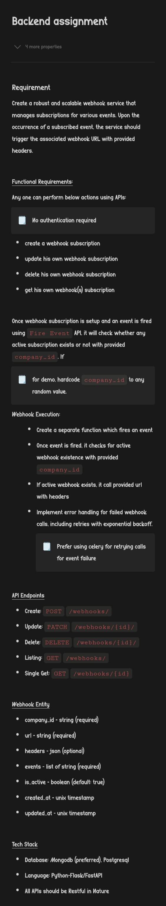

# FastAPI Webhooks

This project provides a FastAPI-based implementation for managing webhooks, powered by MongoDB for data storage and Celery for asynchronous task processing.

## Getting Started

### Install Dependencies

pip install 'fastapi[all]' 'motor[asyncio]' celery requests

pip install redis

brew services start redis

uvicorn main:app --reload

celery -A main.celery worker --loglevel=info

# Install MongoDB using Homebrew
brew tap mongodb/brew

brew install mongodb-community

tar xzvf mongodb-macos*.tgz

cd mongodb-macos*

sudo cp bin/* /usr/local/bin

sudo mkdir -p /usr/local/var/mongodb

sudo mkdir -p /usr/local/var/log/mongodb

sudo chown $USER /usr/local/var/mongodb

sudo chown $USER /usr/local/var/log/mongodb

mongod --dbpath /usr/local/var/mongodb --logpath /usr/local/var/log/mongodb/mongo.log --fork

mongosh

If you face connection issues, add MongoDB to your PATH:
nano ~/.zshrc
export PATH="/usr/local/opt/mongodb-community/bin:$PATH"
source ~/.zshrc

Or start MongoDB using:
mongosh

Test the Webhook:
http POST http://127.0.0.1:8000/webhooks/ company_id=test url=http://test.com/events headers:='{}' events:='["event1", "event2"]'

Fire an Event:
http POST http://127.0.0.1:8000/fire-event/ '{"event_data": "your_event_data"}'

Test using Postman-

1. Create a Webhook Subscription:
Method: POST
URL: http://127.0.0.1:8000/webhooks/
Headers: Content-Type: application/json
Body:
{
  "company_id": "your_company_id",
  "url": "http://example.com/events",
  "headers": {},
  "events": ["event1", "event2"]
}

2. Update Your Own Webhook Subscription:
Method: PATCH
URL: http://127.0.0.1:8000/webhooks/{webhook_id}/ (Replace {webhook_id} with the actual ID)
Headers: Content-Type: application/json
Body:
{
  "company_id": "your_company_id",
  "url": "http://updated-url.com/events",
  "headers": {},
  "events": ["updated-event"]
}

3. Delete Your Own Webhook Subscription:
Method: DELETE
URL: http://127.0.0.1:8000/webhooks/{webhook_id}/ (Replace {webhook_id} with the actual ID)

4. Get Your Own Webhook(s) Subscription:
Method: GET
URL: http://127.0.0.1:8000/webhooks/
Query Params: company_id=your_company_id
This will retrieve a list of all webhook subscriptions associated with the specified company ID.

Method: GET
URL: http://127.0.0.1:8000/webhooks/{webhook_id}/ (Replace {webhook_id} with the actual ID)
This will retrieve details about a specific webhook subscription.

5. Fire an Event:
Method: POST
URL: http://127.0.0.1:8000/fire-event/
Headers: Content-Type: application/json
Body:
{
  "event_data": "your_event_data"
}

Contributing:
Feel free to contribute by opening issues or submitting pull requests.

